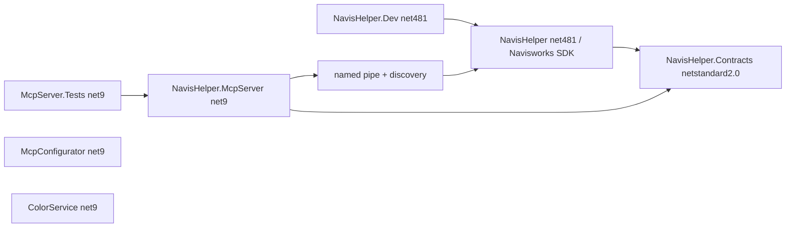

# Roadmap технического долга NavisHelper

Статус документа: подтверждённые и практически обоснованные пункты этапов 0–8 выполнены последовательными buildable границами; спорные и избыточные перестройки оставлены explicitly out of scope. Финальный checkout прошёл 846/846 automated tests, compile/router/catalog guards, Release2024–2027 x64 matrix, SHA-checked AppData deployment, MCP/NWD regressions и воспроизводимый in-process lifecycle smoke панели. Изменения не меняли внешний MCP wire-протокол, MCP tool names или существующие production plugin IDs.

## 1. Зафиксированная база проверки

Проверка выполнена по текущему checkout репозитория до создания этого файла:

- ветка: `codex/technical-debt`;
- worktree до подготовки документа: чистый;
- HEAD: `1e678de`;
- локальный прогон до начала работ: `dotnet test NavisHelper.McpServer.Tests/NavisHelper.McpServer.Tests.csproj /p:Configuration=Release` — 502/502 тестов прошли; после всех formatter/rules/parser/planning/policy seams итоговый текущий результат — 846/846;
- локальная проверка не выполняла build matrix и live Navisworks smoke, потому что на этом этапе не было изменений плагина.

Проверенная baseline этого roadmap — опубликованный релиз `v2.6.3.0` на commit `1e678de`. Размеры и зависимости ниже относятся к этому фактическому release HEAD, а не к цифрам из исходного аудита.

Аудит из `<temp>` использован как список гипотез. Утверждение считается подтверждённым только после проверки исходников, project files, Compile-списка, зависимостей или тестов.

## 2. Текущее состояние архитектуры

В solution фактически 6 проектов: `NavisHelper`, `NavisHelper.Dev`, `NavisHelper.Contracts`, `NavisHelper.McpServer`, `NavisHelper.McpServer.Tests`, `NavisHelper.McpConfigurator`. `ColorService` существует отдельно и намеренно не входит в `.sln`.

Границы верхнего уровня здоровы:

- плагин `NavisHelper` на .NET Framework 4.8.1 взаимодействует с Navisworks SDK и содержит ribbon, AddInPlugin-функции, WPF-панель и MCP host;
- `NavisHelper.Contracts` на `netstandard2.0` используется плагином и MCP-сервером;
- MCP-сервер на .NET 9 общается с host через named pipe, discovery-файлы и общий wire-контракт;
- тесты находятся на стороне чистых Contracts/MCP-компонентов и не требуют Navisworks SDK;
- `NavisHelper.Dev` имеет отдельную рефлексивную runtime-связь с плагином;
- MCP-инструменты зарегистрированы цепочкой `.WithTools<T>()` и разделены на пять тематических типов: general, startup, selection/report, Clash и scenarios. Общие зависимости передаются через `NavisworksToolContext`, а общий минимальный helper находится в `NavisworksToolBase`; публичные имена инструментов не изменились.

Главная проблема находится внутри правильных проектных границ: несколько крупных классов объединяют transport, orchestration, UI, Navisworks state и файловый I/O.

### Подтверждённые размеры и обязанности до Этапа 2

| Файл | Фактический размер | Подтверждённые обязанности |
|---|---:|---|
| `NavisHelper/WPF/NavisHelperPanel.cs` | 9033 строк | построение шести вкладок, события документа, command palette, global hotkeys, selection preview, Clash UI, virtual Clash groups, запуск тестов, CSV/BCF/XML/GIF-экспорт, status/busy state |
| `NavisHelper/Agent/Host/AgentHostService.cs` | 2184 строки | named-pipe listeners, framing, discovery, protocol validation, command dispatch, request gate/bypass, WPF/WinForms UI dispatch, operation history, truncation и lifecycle |
| `NavisHelper/Agent/Services/DocumentCommandService.Clash.cs` | 4545 строк | Clash Detective grouping/ungrouping/status, renumbering, report/viewpoint workflows, batching, cancellation, response shaping и Navisworks state |
| `NavisHelper/Agent/Services/SearchService.cs` | 2928 строк | native search, fallback evaluation, variant coercion, root/path caches, pagination и response shaping |
| `NavisHelper.McpServer/Services/HostBridgeClient.cs` | 1509 строк | typed facade, transport/retry, discovery, PID verification, framing и error mapping; до Этапа 2 здесь также находился большой `BuildResponseSummary` с строки 664 |
| `NavisHelper.Contracts/HostContracts.cs` | 2621 строк | 208 сериализуемых типов в одном файле; смешение transport, selection, viewpoints, Clash, markup и status DTO |
| `NavisHelper.McpConfigurator/Program.cs` | 829 строк | CLI, options flow, JSON/TOML/file adapters и CLI adapters в одном файле |

Размеры в таблице — baseline аудита до физического разбиения Этапа 2. Этап 2 меняет расположение исходного текста, но не уменьшает логический объём обязанностей; функциональное уменьшение coupling начинается только с Этапов 3–7.

`AgentHostService.HandleRequest` занимает примерно строки 380–889 и содержит около 77 сравнений с `HostCommandNames`; bypass-путь находится в строках 918–956, политика bypass повторяется в строках 969–972 и 2142–2143. Это подтверждённая сложность сопровождения, но не доказательство поломки протокола.

## 3. Классификация результатов аудита

### 3.1. Подтверждённые дефекты

1. `NavisHelper/NavisHelper.csproj` — non-SDK project с явным `<Compile Include>`. На исходном checkout XML-анализ показывал 106 tracked `.cs` файлов в `NavisHelper` и только 95 реальных Compile entries. Не включены:

   - `AIColorTestApp.cs`;
   - `SimpleTest.cs`;
   - `Examples/AIColorExample.cs`;
   - `FilterModelsPlugin.cs`;
   - `Interfaces/IAIColorService.cs`;
   - `LocalColorBridge.cs`;
   - `LocalColorService.cs`;
   - `Commands/FilterModelsCommandHandler.cs`;
   - `MergeNwds.cs`;
   - `WPF/FilterModelsPanel.xaml.cs`;
   - `WPF/FilterModelsPanelPlugin.cs`.

   Первые 9 выглядят как чистый stale/dead source: на них нет compiled references, а часть содержит scratch/example-код или старые копии типов. Два WPF-файла явно выключены комментариями в `NavisHelper.csproj:594–597`, поэтому они требуют отдельного решения: удалить как legacy или оформить как документированный allowlist. Их нельзя молча считать runtime-кодом.

   После удаления подтверждённых stale-файлов, механического разбиения и выделения проверенных seams текущий inventory составляет 148 tracked C# files, 146 real Compile entries и 2 явно разрешённых legacy exceptions. Это изменение количества файлов не является возвратом stale-кода: новые files перечислены в non-SDK `.csproj` и проходят compile guard.

2. В source tree есть дублирующиеся имена типов:

   - `FilterModelsPlugin` объявлен в некомпилируемом `FilterModelsPlugin.cs` и в живом `FilterNavisModels.cs`;
   - `LocalColorBridge` и `LocalColorService` имеют некомпилируемые одноимённые файлы, а также реализации внутри `AIColorObjects.cs:428` и `AIColorObjects.cs:785`.

   Это дефект navigability и source hygiene, но не runtime-дублирование: stale-файлы не входят в assembly.

3. `MergeNwds.cs:12` содержит `[Plugin("ImportPslists")]`, совпадающий с `ImportPslists.cs:17`. Поскольку `MergeNwds.cs` не входит в `<Compile>`, текущего runtime-конфликта нет. Правильное исправление на первом этапе — удалить подтверждённый stale-файл, а не менять рабочий plugin ID.

4. У активных compiled plugin IDs есть исторические опечатки: `SaveViewpiontList` (`SaveViewpiontList.cs:12`) и `SaveHierarhy` (`SaveHierarhy.cs:12`). Это плохое имя, но оно может быть внешним compatibility surface. Переименование не является безопасным cleanup и в текущий roadmap не входит.

### 3.2. Подтверждённый технический долг

1. `NavisHelperPanel` — фактический god-class. Конструктор в `NavisHelperPanel.cs:202–286` создаёт UI и одновременно устанавливает global hooks; `CreateClashTab` начинается в строке 3503, virtual grouping — около 4892, запуск всех Clash tests — около 6248, GIF encoder — около 8377. UI, orchestration, Navisworks state и export boundaries отсутствуют.

2. `AgentHostService` объединяет transport и application dispatch. Две UI-dispatch стратегии (`SynchronizationContext` и `Control.BeginInvoke`) живут в одном `InvokeOnUiThread` около строки 975. Класс сам создаёт `SearchService`, `DocumentCommandService` и `MatchSessionStore` в строках 40–42, что ухудшает тестируемость.

3. `DocumentCommandService` уже разбит на 13 partial-файлов, но это в основном физическое разбиение одного типа. Самый большой `Clash`-partial по-прежнему 4545 строк. Значит, partial-разбиение уже принесло локальную пользу, но не создало функциональных границ.

4. `HostBridgeClient.BuildResponseSummary` в строках 664–1343 смешивает transport client с форматированием диагностических summaries. Typed facade, retry и pipe framing находятся рядом. `ResponseSummaryFormatter` — обоснованное изолированное выделение с низким wire-риском.

5. В baseline аудита `NavisHelper.Contracts` содержал 33 source-файла, из которых 4 являлись protocol-centric (`HostContracts.cs`, `Statuses.cs`, `ErrorCodes.cs`, `ProtocolConstants.cs`), а остальные 29 содержали pure helpers, markup geometry/grouping, report HTML, state tracker и Clash option logic. После Stage 2 protocol/feature DTO физически разнесены, но namespace и assembly сохранены. Stateful `ClashReportOperationTracker` позднее перенесён в `NavisHelper/Agent/Services`; его wire response DTO остался в Contracts, а unit-тесты source-link SDK-independent host implementation. Оставшийся debt относится к таксономии сборки и не доказывает необходимость нового проекта.

6. UI и MCP имеют отдельные Clash workflows. В панели есть virtual grouping, UI preview, grouping tree, viewpoint/export actions; в `DocumentCommandService.Clash.cs` и `Agent/Services/Clash*` есть MCP grouping, report, renumbering, viewpoint и state workflows. При этом часть общего поведения уже переиспользует `ClashGroupMutationService` и Contracts helpers. Поэтому подтверждён сам факт двух orchestration paths, но не доказано, что весь код является построчным дубликатом и должен быть слит.

7. Тестовая граница асимметрична: baseline аудита составлял 38 test-файлов и 502 теста, хорошо покрывавших Contracts/MCP pure helpers, DTO round-trip и некоторые protocol invariants. После выделения formatter/search rules/saved-viewpoint redline/camera parser, трёх SubtreeDump seams, Clash BBox и ungroup selection plan seams, трёх virtual-group policies, общей saved-item name policy, grouping-path/group-display policies и host bypass policy текущий результат — 846 тестов. Прямых unit-тестов для Navisworks-dependent частей `AgentHostService`, `DocumentCommandService`, WPF-панели и остальных runtime services всё ещё нет; для них существуют live smoke/regression scripts, но они не заменяют unit/contract tests для новых pure seams.

8. `McpConfigurator/Program.cs` действительно является большим файлом с несколькими adapter families. Это умеренный структурный debt, не причина менять поведение конфигуратора в первой волне.

9. `ShowNavisHelperPanel.cs:16` и `NavisHelperPanel.cs:39` содержали одинаковую fallback-карту для прямого запуска `ExportColors.CBC`/`ImportColors.CBC`. Самые верхнеуровневые списки кнопок и command palette не являются одной картой: они принадлежат разным UI/lifecycle и содержат разные команды. Подтверждённое дублирование fallback-routing устранено через `NavisHelper/PluginCommandExecutor.cs`; полное объединение UI-списков не оправдано без отдельного lifecycle/compatibility решения.

### 3.3. Косметические замечания

- `HostBridgeClientTests.cs` содержит класс `InstanceDiscoveryStoreTests`; mismatch имени файла и класса подтверждён, но на продуктовый runtime не влияет.
- Суффиксы `Clash*Service` у многих `internal static` utility-классов неидеальны, но массовое переименование не даёт самостоятельной ценности и создаёт шум в diff.
- `AgentRuntime` держит host singleton и interactive-busy gate. Это небольшая неоднородность, но не приоритет до стабилизации host seams.
- В source tree есть два smoke entrypoint-а (`scripts/navishelper_mcp_smoke.py` и `tools/mcp_smoke_test.py`). Они имеют разные packaging/use cases; автоматически удалять один нельзя.
- Файлы и каталоги в корне `NavisHelper` плоские, но физическая перестановка сама по себе не улучшит runtime и должна быть отделена от функциональной декомпозиции.

### 3.4. Спорные архитектурные предложения

1. Новый `NavisHelper.Domain` не следует создавать сейчас. Сейчас `Contracts` — общий `netstandard2.0` слой, который уже даёт тестируемость без Navisworks SDK. Новый проект создаст новую assembly/deployment boundary, потребует новых references и изменения bundle/package logic. Практическая польза будет доказана только если один pure component реально нужен нескольким потребителям, не является wire DTO и выигрывает от отдельного version/dependency boundary.

2. Объединение `ClashPreviewManager` и `SelectionPreviewManager` нельзя считать механическим. `SelectionPreviewManager.cs:12` прямо называет себя аналогом, но Clash preview работает с двумя сторонами Clash, markers, groups и Clash boxes, а selection preview — с selection/context/section box. Сначала нужны characterization tests и общий минимальный snapshot seam; затем можно решить, есть ли полезная общая абстракция.

3. Полный target tree из аудита (`Plugins/`, `Agent/Commands/`, `WPF/Tabs/`, новые namespaces и переименования) слишком широк для первой итерации. Он должен быть результатом нескольких завершённых этапов, а не стартовой миграцией.

4. Разрыв `DocumentCommandService` и `AgentHostService` на десятки новых классов нельзя объявлять «в основном перемещением». В этих местах находятся UI-thread affinity, request gate, cancellation, Navisworks document state, response/error semantics и operation history. Это behavior-sensitive changes.

5. `FolderPicker` в `ExportImportColors.cs:20` и `FolderPickerDialog` в `Core/FolderPickerDialog.cs:9` — не одна копия одного класса: это разные WinForms/COM-first реализации с разным UX и fallback. Объединение не включать без отдельного product decision.

### 3.5. Уже исправленные или уже защищённые пункты

- `HostCommandNames` содержит 70 констант и 70 уникальных wire values; исходное утверждение аудита о 95 константах не подтвердилось.
- `DocumentCommandService` уже имеет отдельные `Clash.Listing.cs`, `Clash.Planning.cs`, `Clash.Workflow.cs` и делегирует часть pure rules в helper/service boundary. Нельзя планировать это как полностью нетронутый монолит.
- `MarkupFrameGroupingHelper` уже содержит spatial sweep/guard limits, а тесты покрывают большие разделённые и dense selections. Нельзя возвращать unconditional all-pairs scan для больших выборок.
- В checkpoint-документации уже зафиксированы исправления silent catches, deferred request-gate completion, interactive busy gating и ряд Clash/report helper extractions. Эти пункты не следует повторять как новый debt.
- Ранее зафиксированное ограничение «все MCP tools должны оставаться одним типом из-за `.WithTools<NavisworksTools>()`» перепроверено и не подтвердилось: SDK поддерживает цепочку регистраций `.WithTools<T>()`. Partial-контейнер безопасно разделён на пять тематических типов без изменения wire-имён; stdio smoke дополнительно проверяет единственность зарегистрированных имён.
- Удалены четыре полностью недостижимых legacy source-файла с `AddInPlugin`-типами. Compile guard теперь проверяет reachability каждого compiled `AddInPlugin`, а baseline `scripts/navishelper_partial_limits.txt` не позволяет незаметно наращивать существующие god-partials. Правило «новая feature-family не становится новым partial» зафиксировано в `AGENTS.md`.
- Mutable `ClashReportOperationTracker` и его внутреннее operation state перенесены из Contracts в Navisworks host services без изменения status/cancel поведения и wire DTO. Это осознанно удаляет два ранее public, но не wire-facing типа из assembly surface `NavisHelper.Contracts` в версии 2.8.2.0; поиск по McpServer/McpConfigurator подтвердил отсутствие production consumers. Существующие characterization tests сохранены через source-link чистого host-файла в test project; README Contracts теперь явно разделяет допустимые deterministic transition rules и недопустимые long-lived runtime coordinators.
- Разделение `NavisHelper.Dev` и `ColorService` от MCP wire path является осознанной project boundary, а не причиной добавлять Domain.

### 3.6. Проверка повторного post-refactor аудита

Повторный аудит принят как advisory input и перепроверен по текущему checkout. Из его пяти рекомендаций две оказались подтверждёнными и выполнены, а три не имеют достаточной практической пользы для продолжения рефакторинга:

1. Добавлен `NavisHelper.Contracts/README.md`, явно фиксирующий фактическую границу dependency-free `netstandard2.0` assembly: wire contracts и детерминированные pure policies/parsers/formatters разрешены; Navisworks, UI, transport и deployment logic запрещены. Это снимает навигационный риск нечестного имени без новой assembly/deployment boundary. Остаточные пустые строки в `DocumentCommandService.cs` удалены.
2. Bypass-знание централизовано в `NavisHelper.Contracts/HostRequestPolicy.cs`. Классификация четырёх bypass-команд и отдельного подмножества operation-status polls теперь имеет один источник, 12 contract tests и exact CI guard. Typed router по-прежнему не содержит bypass-команды; wire names и dispatch behavior сохранены.
3. Предложение слить шесть option helpers отклонено. `FindItemsConditionOptionsHelper` относится к Search/Selection Set, а не к Clash; остальные helpers имеют разные потребители и оси изменения (numeric report options, scope labels, test-name prefixes, test-type aliases, BBox limits). Общий файл уменьшил бы число файлов, но ухудшил cohesion и не создал бы общего runtime invariant.
4. Предложение немедленно превратить non-Clash partials `DocumentCommandService` в отдельные классы отклонено как преждевременное. 65 typed routes пока направлены в единый facade; partials используют общие private helpers/constants и Navisworks document/UI-thread semantics. Следующий реальный class boundary допустим только после dependency map, явного composition seam и characterization/live tests конкретной одной feature-family. Это не механический перенос.
5. Массовое снятие суффикса `Service` остаётся косметическим out of scope: оно создаёт широкий diff без изменения ответственности, зависимости или тестируемости.
6. Повторный tool-less Claude review post-refactor increment успешно завершён без блокеров. Его подтверждённые замечания к CI защите закрыты: special dispatch ограничен exact-набором `FindItems`, enum bypass обязан иметь полный набор dispatch arms, call sites transport/dispatch/history проверяются, а exhaustive contract test фиксирует 70 команд, ровно 4 bypass и ровно 2 status-poll значения. Замечания об отсутствующем ADR и параллельном MCP bypass-list не подтвердились.

## 4. Целевое состояние без избыточной перестройки

Цель — не новая архитектура ради дерева каталогов, а несколько проверяемых seams вокруг существующего поведения:

### Ограничения и архитектурные инварианты

1. Host transport, request-gate policy, command routing, UI dispatch и operation history должны быть физически различимы, но до миграции сохранять текущий `AgentHostService` lifecycle.
2. `DocumentCommandService` остаётся compatibility facade, пока отдельная feature-group не имеет собственного handler/module и тестов. Нельзя менять все partials одновременно.
3. `NavisHelperPanel` постепенно превращается в shell: сначала физические partials, затем изолированные exporters/engines, затем вкладки. Constructor side effects, document events и `static Current` меняются только отдельным lifecycle increment; выполненный increment теперь имеет явный `Loaded`/`Unloaded` ownership и live lifecycle harness.
4. UI и MCP используют общие pure algorithms только там, где доказано одинаковое правило. UI adapters не должны принимать MCP wire DTO только ради reuse.
5. `NavisHelper.Contracts` остаётся текущей assembly до отдельного решения по Domain. Физическое разбиение файлов может сохранять namespace и assembly name; правила приёма кода закреплены в `NavisHelper.Contracts/README.md`.
6. Любая новая команда добавляется с единым источником wire name и route descriptor; существующие 70 `HostCommandNames`, snake_case JSON keys и MCP tool names не меняются.
7. Любой шаг оставляет solution собираемым. Для plugin-touching PR обязательны `Release2024|x64`, `Release2025|x64`, `Release2026|x64`, `Release2027|x64`.

## 5. Последовательность этапов

### Этап 0 — инвентаризация и защитные проверки

**Цель.** Зафиксировать baseline, чтобы последующие structural changes не меняли публичную поверхность незаметно.

**Содержание отдельного PR.**

- добавить read-only проверку фактических Compile entries non-SDK `NavisHelper.csproj`;
- зафиксировать явным allowlist все 11 tracked-but-not-compiled файлов: удалить 9 подтверждённых stale-файлов на следующем PR, а 2 отключённых WPF-файла оставить до отдельного решения;
- проверять отсутствие duplicate compiled plugin IDs после удаления C# comments, но не менять IDs;
- сравнивать 70 `HostCommandNames` wire values с reviewed snapshot;
- запускать `scripts/check_mcp_command_catalog.py` с exact-check generated MCP index, включая stale и missing tool names;
- сохранить baseline: 70 host command values, 81 implemented MCP tools, 502 tests, project dependency graph и текущие smoke entrypoints;
- при необходимости добавить contract snapshots для protocol version, request/response field names и bypass command set.

**Зависимости:** нет.

**Риск:** низкий; изменения только в checks/docs.

**Критерии приёмки:** `python scripts/check_navishelper_compile.py` подтверждает 95 real Compile entries, 11 explicit exceptions, 70 unchanged `HostCommandNames` values и уникальность compiled plugin IDs; `python scripts/check_mcp_command_catalog.py` подтверждает exact generated index из 81 implemented MCP tools; CI запускает обе проверки; существующие 502 теста проходят; исходный plugin assembly и его IDs не меняются. Дальнейшие действия Этапа 1 (удаление stale-файлов) не входят в этот PR.

### Этап 1 — подтверждённый stale-код и CI-контроль Compile

**Статус:** выполнен. Удалены девять подтверждённых stale-файлов; два явно отключённых WPF-файла оставлены в allowlist до отдельного решения. После удаления inventory содержит 97 существующих tracked `.cs`, 95 real Compile entries и 2 legacy exceptions.

**Цель.** Удалить только доказанный мусор и сделать невозможным незаметное накопление такого же source debt.

**Содержание.**

- отдельным PR удалить 9 подтверждённых stale-файлов из списка в разделе 3.1;
- не удалять два отключённых WPF-файла до принятия решения по allowlist;
- не менять plugin IDs, namespaces, DTO и behavior;
- включить Compile/source guard в CI рядом с существующим MCP catalog check.

**Зависимости:** завершённый Этап 0 и решение по двум disabled WPF files.

**Риск:** низкий для runtime, низкий/средний для source consumers, если кто-то использовал scratch-файлы напрямую.

**Критерии и тесты:** `git grep` не находит production references к удаляемым типам; `dotnet test` 502/502; четыре локальные Release build `2024–2027|x64`; `git diff --check`; package/install scripts не видят новых отсутствующих bundle artifacts.

### Этап 2 — безопасное физическое разбиение крупных файлов

**Прогресс:** все families выполнены отдельными mechanical changes. `HostContracts.cs` заменён на 13 feature-файлов в том же namespace; 208 class blocks прошли parity-проверку без изменений. `AgentHostService.cs` заменён на core-файл и 7 partial-файлов (`Lifecycle`, `Transport`, `Dispatch`, `Document`, `Discovery`, `Response`, `OperationHistory`); 70 member blocks прошли parity-проверку, сохранены тип, namespace, поля и lifecycle. `HostBridgeClient.cs` заменён на core-файл и 5 partial-файлов (`Diagnostics`, `Commands`, `Transport`, `Discovery`, `ResponseSummary`); 101 member block прошёл parity-проверку без semantic diff. `NavisHelperPanel.cs` заменён на core-файл и базовые partial-файлы (`Colors`, `Selection`, `Viewpoints`, `Clash`, `Resources`), а последующая Stage 7 граница дополнительно разнесла Clash UI по lifecycle/shell/grouping/selection/operations/preview/settings partials; 410 исходных member blocks прошли canonical parity-проверку с отличиями только в whitespace. После полной матрицы `Release2024–2027|x64` панель программно открыта через штатный AddIn ID `ShowNavisHelperPanel.CBC` в живом Navisworks 2027 на тестовом NWD; лог подтвердил `CreateControlPane`, `ElementHost` и `NavisHelperPanel loaded` без ошибки инициализации панели. `McpConfigurator/Program.cs` разделён на core и 5 partial-файлов (`Options`, `FileAdapters`, `CliAdapters`, `ConfigFileHelpers`, `Process`); 24 member blocks прошли canonical parity-проверку, configurator build и CLI `--help` прошли.

**Цель.** Улучшить навигацию без изменения типов, namespace, assembly, JSON или control lifecycle.

**Правило PR.** Каждый family — отдельный PR; не объединять все разбиения в один mega-PR.

1. `HostContracts.cs` — разложить DTO по feature-файлам, сохранив namespace `NavisHelper.Agent.Contracts`, class names, property names и assembly.
2. `AgentHostService.cs` — сделать partial-файлы по transport, dispatch, UI dispatch, operation history, не создавая новый lifecycle. Выполнено: partial-файлы включены в non-SDK `.csproj`; full matrix `Release2024–2027|x64`, 502 MCP tests, compile/catalog guards и live Navisworks 2027 `host_status` smoke прошли. Discovery SHA совпал с установленным per-user bundle SHA `AEF4C1E8539B964B6C144A2D9ECC8470BCB5B69C40C7A85AA4E68CF0AF9E1933`.
3. `HostBridgeClient.cs` — отделить typed facade, transport/discovery и diagnostics физически; behavior остаётся прежним. Выполнено: 101 member block сохранён, `dotnet test` 502/502, public MCP stdio smoke (`mcp_diagnostics` + targeted `host_status`) прошёл против свежего Navisworks 2027 host.
4. `NavisHelperPanel.cs` — сделать физические partials по shell/selection/colors/viewpoints/Clash/export; это не извлечение UserControl и не смена event lifecycle. Выполнено: сохранены тип `NavisHelperPanel`, namespace, `UserControl`, конструктор и event lifecycle; live UI smoke подтвердил создание dock pane и загрузку панели.
5. `McpConfigurator/Program.cs` — вынести adapter classes, если compiler и tests подтверждают отсутствие semantic diff. Выполнено: сохранены nested type names/visibility, CLI surface и file/config behavior; configurator build, CLI `--help`, 502 MCP tests и member parity прошли.

`DocumentCommandService` в этом этапе не «распускать»: его partial-файлы уже существуют, а функциональная декомпозиция относится к Этапу 5.

**Зависимости:** Этап 1 для Compile guard.

**Риск:** низкий/средний. Главный риск — пропущенный private/static member, resource entry или explicit Compile entry; у panel дополнительно опасны partial-order assumptions и event handlers.

**Критерии и тесты:** zero behavior diff по API/source snapshots; обычные MCP tests; для каждого PR, затрагивающего `NavisHelper`, полная Release matrix 2024–2027 x64; для panel/host partials — live host startup smoke и MCP regression на test NWD.

### Этап 3 — `ResponseSummaryFormatter` и другие изолированные компоненты

**Цель.** Вынести компоненты с ясным входом/выходом, не меняя wire protocol.

**Прогресс:** `BuildResponseSummary` вынесен в `NavisHelper.McpServer/Services/ResponseSummaryFormatter.cs` как internal pure formatter. В `HostBridgeClient` оставлены `Error`, `ExtractErrorCode`, `CreateJsonOptions`, transport/retry/discovery и остальные границы; изменены только два call site. Parity-проверка метода относительно baseline прошла с отличиями только в сигнатуре/whitespace. Добавлены characterization tests для null/unknown, ключевого порядка, computed counts, пустой ancestry, текущего `NullReferenceException` поведения и dispatch всех 54 поддерживаемых response types. Зафиксировано фактическое wire-поведение: null-значения в summary dictionary сохраняются и попадают в JSON. `dotnet test` прошёл `510/510`, затем pure find-items rules seam добавил ещё 25 тестов, Search Set condition rules — ещё 35, saved-viewpoint redline XML parser — ещё 12, camera XML parser — ещё 36, SubtreeDump output formatter — ещё 25, SubtreeDump job policy — ещё 23, SubtreeDump root rules — ещё 27, Clash BBox plan helper — ещё 27, virtual-group identity policy — ещё 42, reference-membership policy — ещё 8, cache snapshot/restore policy — ещё 10, saved-item name/unique-candidate policy — ещё 22, grouping-path policy — ещё 13, group-display policy — ещё 11, host request policy — ещё 12; текущий результат — `838/838`. MCP server build — без предупреждений и ошибок. Публичный MCP stdio smoke на живом Navisworks 2027 с активным NWD прошёл: 81 tool, host status, health, search, subtree dump, properties и `mcp_recent_calls`; в host-call log summaries сохранили ожидаемые snake_case ключи, порядок и null-поля.

**Первый кандидат:** до Этапа 2 это был `BuildResponseSummary` из `HostBridgeClient.cs:664–1343`; после физического разбиения baseline-метод находился в `HostBridgeClient.ResponseSummary.cs`. Отдельным маленьким PR можно вынести error-contract catalog из текущих строк `HostBridgeClient.ResponseSummary.cs`.

**Инварианты:** формат summaries, known response coverage, null/unknown behavior, error codes, retry и pipe framing не меняются. Не заменять type-switch на DTO attributes до отдельного решения.

**Зависимости:** физическое разбиение HostBridgeClient на Этапе 2.

**Риск:** низкий/средний; риск в основном диагностический, но MCP logs используются при расследовании live failures.

**Критерии и тесты:** unit tests на known response types, empty/null/unknown cases и ключи summary; базовые MCP tests плюс 8 formatter tests, 25 find-items rules tests, 35 Search Set condition rules tests, 12 saved-viewpoint redline parser tests, 36 camera parser tests, 25 SubtreeDump output formatter tests, 23 SubtreeDump job policy tests, 27 SubtreeDump root-rule tests, 27 Clash BBox plan tests, 42 virtual-group identity tests, 8 reference-membership tests, 10 cache-policy tests, 22 saved-item name/unique-candidate tests, 13 grouping-path tests, 11 group-display tests и 12 host request policy tests (`838/838`); MCP smoke/regression с проверкой host-call logs; plugin matrix не требуется, если PR не касается plugin project.

### Этап 4 — типизированный `CommandRouter` при сохранении старого поведения

**Прогресс:** обычная UI-dispatch ветка переведена на `NavisHelper/Agent/Host/CommandRouter.cs` с typed `Register<TRequest>` routes и `StringComparer.OrdinalIgnoreCase`; `AgentHostService.CommandRouter.cs` регистрирует 65 обычных маршрутов. `HostStatus` зарегистрирован с игнорированием payload, чтобы сохранить прежнюю семантику. `FindItems` оставлен отдельной characterization-веткой из-за request-specific `timeoutMs` и исходного diagnostic log; четыре request-gate bypass-команды оставлены отдельной веткой с единой классификацией в `HostRequestPolicy`. `scripts/check_host_command_router.py` подтверждает покрытие всех 70 `HostCommandNames` (65 typed + 1 special + 4 exact policy bypass), отсутствие duplicate route references и пересечения bypass с typed router. Полная матрица `Release2024–2027|x64` прошла, сохранён только прежний `CS0067`. После установки свежего AppData bundle (SHA/assembly length соответствуют сборке) live host smoke и публичный MCP stdio smoke на Navisworks 2027 прошли: `host_status`, bypass status/cancel commands, health, search, subtree dump, properties и `mcp_recent_calls`.

**Цель.** Убрать ручную цепочку dispatch без изменения внешнего command surface.

**Содержание.**

- ввести typed route descriptor/registry с `Register<TRequest>(name, handler)` или эквивалентом;
- оставить `HostCommandNames` единственным источником wire names;
- сохранить `OrdinalIgnoreCase` matching, payload deserialization, `EnsureDocument`, request IDs, elapsed times, error messages/codes, operation history и unknown-command behavior;
- bypass-команды оформить отдельной policy, но зарегистрировать их один раз;
- не переносить в router Navisworks state, UI thread или response serialization раньше времени.

Это не должен быть «новый host с нуля». Сначала router получает characterization tests, затем заменяет только обычную dispatch-ветку; bypass и UI dispatch мигрируют отдельными изменениями.

**Зависимости:** Этапы 0–3. Если нужен отдельный `AgentHost` composition seam, он оформляется отдельным PR после router, а не в одном diff с ним.

**Риск:** высокий для wire-compatible behavior, несмотря на механический вид.

**Критерии и тесты:**

- unit/contract tests для case-insensitive lookup, duplicate registration, unknown command, payload type и bypass classification;
- parity-check всех текущих routes против baseline; 70 constants должны остаться без изменений;
- `scripts/navishelper_mcp_regression.ps1`, host smoke и failure-mode tests на live Navisworks;
- полная Release2024–2027 x64 matrix и проверка установленной AppData bundle SHA/timestamp перед smoke.

Если router нельзя протестировать без ссылки на Navisworks SDK, сначала выделяется минимальный pure route descriptor seam; новый `NavisHelper.Domain` для этого не создаётся автоматически.

### Этап 5 — постепенная декомпозиция `DocumentCommandService`

**Прогресс:** безопасный non-Clash слой выполнен отдельными mechanical functional changes: `DocumentCommandService.SelectionQueries.cs` содержит 7 selection operations, `DocumentCommandService.Visibility.cs` — 6 visibility operations, `DocumentCommandService.SelectionSetQueries.cs` — list/select/create selection-set routes и их match-handle helper, `DocumentCommandService.ViewportCommands.cs` — current/list/activate/create/zoom/focus/fit viewpoint commands и COM bridge helper. Selection Set tree management дополнительно разделён без изменения тел: `DocumentCommandService.SelectionSetManagement.cs` содержит manage orchestration, `DocumentCommandService.SelectionSetReorder.cs` — reorder orchestration, `DocumentCommandService.SelectionSetTree.cs` — общий lookup/index/folder resolver; `DocumentCommandService.SelectionSets.cs` теперь содержит только `CreateSearchSet` и его validation wrappers и уменьшился с 1123 до 155 строк. Поблочное сравнение с исходной веткой подтвердило 22/22 exact method-body matches. Live read-only smoke прошёл для `list_selection_sets`, `selection_sets_manage(create_folder, apply=false)` и `selection_sets_reorder(apply=false)`. Дополнительно public handlers исходного Clash partial разложены без изменения тел методов: 3 grouping/renumber/manage handlers в `DocumentCommandService.Clash.Grouping.cs`, 2 pair/matrix handlers в `DocumentCommandService.Clash.Matrix.cs`, 5 report/viewpoint/status handlers в `DocumentCommandService.Clash.Report.cs`. Остаточные private Clash groups также разделены по доказанным границам: `Clash.ExecutionSupport.cs`, `Clash.BboxSupport.cs`, `Clash.GroupSupport.cs` и `Clash.ReportSupport.cs`; compatibility type, namespace, nested types и bodies методов сохранены, а core-файл оставлен для shared constants/state. `SearchService.cs` также оставлен compatibility partial-фасадом: command handlers находятся в `SearchService.Commands.cs`, root/path index — в `SearchService.Index.cs`, native/manual execution — в `SearchService.Execution.cs`, а request normalization и safety rules — в `SearchService.Rules.cs`; четыре pure правила вынесены в `NavisHelper.Contracts/FindItemsSearchRulesHelper.cs` с 25 characterization tests, без создания Domain. Для persisted Search Sets pure normalization/classification вынесена в `NavisHelper.Contracts/SearchSetConditionRulesHelper.cs`: aliases, combine/data type/logical defaults, Item/Name mapping и warning classifiers покрыты 35 characterization tests, включая все прежние data-type aliases, unknown fallback и реальные UTF-8 `Элемент`/`Имя`; plugin wrappers сохраняют прежний `schema_violation`. Navisworks-specific construction теперь изолирован в `NavisHelper/Agent/Services/SelectionSetSearchBuilder.cs`: native `SearchCondition`, flags, `VariantData`, runtime display-property binding и timeout больше не принадлежат compatibility facade. Saved-viewpoint redline XML parsing вынесен в `NavisHelper.Contracts/SavedViewpointRedlineXmlParser.cs`: line/ellipse/arrow conversion, color threshold, namespace-insensitive nodes и warning semantics покрыты 12 tests; JSON.NET adapter оставлен в plugin для сохранения exact number/property formatting. Reflection comparison восьми baseline samples подтвердил полное совпадение JSON и warnings. Camera XML parsing вынесен в `NavisHelper.Contracts/SavedViewpointCameraXmlParser.cs`: direct-child/descendant lookup semantics, numeric defaults, projection/render/lighting/viewer aliases и warning strings покрыты 36 tests; создание Autodesk `Viewpoint`, enum mapping и setter-level exception/logging boundaries оставлены в plugin adapter. Внешний tool-less review подтвердил exact parity camera-пути без блокеров. Live `saved_viewpoints_import` dry-run на свежем AppData bundle успешно разобрал fixture с camera/up/folder/view/line/ellipse/arrow при `preserveXmlFolders=true/false`, без warnings и без изменения документа. `DocumentCommandService.Viewpoints.cs` уменьшился с 1515 до 1379 строк после двух отдельных parser seams. После полного набора переносов прошли `dotnet test` `643/643`, compile/catalog/router guards, полная `Release2024–2027|x64` matrix и live host/MCP smoke на активном NWD. Этим закрыты pure rules, Search Set builder/tree management, redline parser и camera parser boundaries; остальные stateful engine changes остаются отдельными кандидатами, а не скрытой частью одного PR.

Saved-viewpoint orchestration затем физически разделён по уже существующим command-family boundaries: `DocumentCommandService.Viewpoints.Export.cs` (157 строк), `DocumentCommandService.Viewpoints.Import.cs` (566), `DocumentCommandService.Viewpoints.Management.cs` (516) и общий tree/index partial `DocumentCommandService.Viewpoints.cs` (178). Генератор split подтвердил 57/57 exact member blocks до применения patch; были добавлены только необходимые file-local `using` directives и Compile entries. Live smoke покрыл list/tree, CSV export с проверкой созданного файла, import dry-run без warnings, manage create-folder dry-run и reorder dry-run; временный CSV удалён, документ не изменялся. Полная matrix и guards повторно прошли.

Clash report support также механически разделён по существующим границам без изменения тел 80 методов: scope/manage/list façade `DocumentCommandService.Clash.ReportSupport.cs` (531 строк, 26 methods), row/association/cluster shaping `DocumentCommandService.Clash.ReportDataSupport.cs` (734, 35) и path/options/box/report-item shaping `DocumentCommandService.Clash.ReportOutputSupport.cs` (372, 19). Все три файла сохраняют тот же `internal sealed partial DocumentCommandService`; Compile entries добавлены явно. Tool-less review подтвердил отсутствие duplicate/signature/type drift; отдельно проверено, что русские literals `убывание`, `объект`, `геометрия`, `тело` сохранены в UTF-8. Live dry-run на NWD с 43 Clash tests обработал один тест с 11 результатами, вернул page 5/11 и 3 hybrid clusters с handles/tags/bounds, не создав output directory и не изменив документ.

SubtreeDump file-output seam выделен в `NavisHelper.Contracts/SubtreeDumpOutputFormatter.cs`: normalization, CSV header/escaping/row и ordered JSON row values покрыты 25 characterization tests, а Newtonsoft serialization, UTF-8 BOM/newline semantics, traversal, job state и file lifecycle оставлены в plugin adapter. `DocumentCommandService.SubtreeDump.cs` уменьшился с 934 до 906 строк. Byte-level live comparison старой и новой AppData DLL подтвердил 8/8 exact SHA для CSV/JSONL × `includePath` true/false × `includeSourceFile` true/false, по 100 реальных model items на вариант; public MCP smoke и cancellation-after-progress также прошли. Tool-less external review не нашёл блокеров; возможный JSON null delta исключён проверкой non-null contracts `GetItemDisplayName`/`BuildItemPath`.

Следующим отдельным functional seam вынесена pure job policy в `NavisHelper.Contracts/SubtreeDumpJobPolicy.cs`: legacy defaults/maxima для poll limits, case-insensitive running-state, строгие двухчасовой completed retention и тридцатиминутный running expiry cutoffs, status mapping, `IsDone`, null-error normalization и усечение elapsed milliseconds покрыты 23 characterization tests. Plugin по-прежнему владеет dictionary/job locks, `ModelItem` stack, writer disposal, atomic commit/delete и порядком cleanup. Tool-less review подтвердил exact parity; замечание о моменте захвата `DateTime.UtcNow` устранено сохранением legacy порядка. Live host lifecycle прошёл start → one-item status → cancel → repeated status: состояние стабильно `cancelled`, pending очищен, final и `.partial` удалены. Публичный MCP smoke дополнительно дошёл до 4000 processed items и корректно отменил job.

Root-resolution string rules затем вынесены в `NavisHelper.Contracts/SubtreeDumpRootRules.cs`: четыре допустимых extension, trim/alias dedup, Windows/Unix separator handling, trailing-separator quirk и case-insensitive exact match покрыты 27 tests. Autodesk `ModelItem` traversal, first-level-before-recursive search, ancestor filtering и path de-duplication оставлены в plugin. Tool-less review подтвердил parity; live MCP smoke сохранил `2/2` root matches и cancellation after 4000 items.

Для command-side Clash BBox planning выделен `NavisHelper.Contracts/ClashBboxPlanHelper.cs`: exact root filters и их legacy blank quirks, preview shaping/truncation, shallow DTO copy, case-insensitive reason-count clone и CSV header/escaping/row semantics покрыты 27 tests. `BoundingBox3D`, units, pair geometry/refinement, output path/file ownership и Clash test mutation остались в plugin. `DocumentCommandService.Clash.BboxSupport.cs` уменьшился с 730 до 667 строк. Tool-less review не нашёл блокеров; property-for-property comparison подтвердил exact clone. Live `clash_bbox_pair_plan` на трёх NWD roots вернул 3 candidate pairs, preview 2 с `preview_truncated=true`, создал CSV с exact 8-column header и 3 rows; public MCP health остался healthy.

**Цель.** Сохранить фасад и переносить по одной функциональной группе.

**Порядок.**

1. начинать с узкой группы с ясным входом/выходом, например selection sets или document save;
2. затем выделять viewpoints/markup/property workflows;
3. Clash mutation/report workflows из `DocumentCommandService.Clash.cs` делать последними и не смешивать с Panel extraction;
4. временно оставлять thin compatibility methods в `DocumentCommandService`, пока host routes и tests переключаются;
5. каждый модуль получает собственные pure validation/response tests, а Navisworks-specific orchestration остаётся на границе документа.

Нельзя в одном PR одновременно распускать partial class, переименовывать `Clash*Service`, менять DTO и менять error semantics.

**Зависимости:** Этап 4; для Clash-групп — результат соответствующего анализа Этапа 6 не должен блокировать первый безопасный non-Clash module.

**Риск:** средний для простых command groups, высокий для Clash/report/viewpoint groups.

**Критерии и тесты:** unit tests validation/planning/response shaping; contract tests JSON; live smoke соответствующего command family; для Clash — run/list/group/status/renumber/report/viewpoint regression, cancellation и large-selection guard; полная plugin matrix для каждого plugin-touching PR.

### Этап 6 — устранение доказанного дублирования Clash UI/MCP

**Статус:** общий Clash merge не выполнялся: `docs/CLASH_UI_MCP_BEHAVIOR_MATRIX.md` подтверждает, что ключевая mutation/iteration-логика уже переиспользуется через `ClashGroupMutationService`, `ClashWorkflowService`, `ClashGroupNameHelper`, `ClashDocumentStateService` и связанные helpers. Остаточные совпадения находятся на уровне orchestration, UI-only virtual groups, разных preview/export/cancellation workflows или имеют различия в правилах имён и lifecycle. При этом подтверждённый узкий duplicate fallback-routing двух панелей устранён отдельным безопасным изменением: общий `PluginCommandExecutor` сохранил те же два plugin ID и тот же порядок «direct call → Navisworks registry». Поэтому Stage 6 закрыт без рискованного общего merge; возвращаться к нему следует только при появлении characterization/differential fixture, показывающей одинаковый результат для более крупного pure-компонента.

**Цель.** Сблизить только одинаковые правила и оставить различающиеся UX/workflows отдельными.

**Сначала:** составить behavior matrix для UI и MCP: grouping name rules, persistent groups, virtual groups, preview colors/transparency, saved viewpoints, BCF/CSV/GIF/report outputs, cancellation и document restore. Отметить, где уже используются `ClashGroupMutationService` и Contracts helpers.

**Допустимые кандидаты:** pure name normalization, option validation, deterministic grouping keys, report/geometry helpers, snapshot/restore primitives — только при доказанном одинаковом результате.

**Запрещено:** делать UI зависимым от MCP wire DTO; переносить Navisworks document mutations в netstandard helper; считать одинаковые имена классов доказательством одинакового behavior.

**Зависимости:** Этап 5 для понимания command-side boundaries и Этап 2 для panel partials. На текущем состоянии зависимость проверена behavior matrix; новый общий слой не создаётся.

**Риск:** высокий: различия UI и MCP могут быть намеренными, а Clash state чувствителен к порядку операций.

**Критерии и тесты:** golden/characterization fixtures для одинаковых входов; differential tests pure portions; live regression обеих точек входа на одном test NWD; проверка restore цветов, transparency, viewpoints, groups и unsaved document state; full matrix 2024–2027 x64.

### Этап 7 — постепенная декомпозиция `NavisHelperPanel`

**Прогресс:** выполнены два низкорисковых exporter/diagnostic seams: `ExportSelectedClashesToBcf` целиком перенесён в `NavisHelper/WPF/NavisHelperPanel.ClashExport.cs`, а `CreateClashOrbitGif` с его capture/GIF helpers — в `NavisHelper/WPF/NavisHelperPanel.ClashOrbitExport.cs`; camera diagnostic output — в `NavisHelper/WPF/NavisHelperPanel.ClashDiagnostics.cs`. Затем физически разделён остаточный Clash UI compatibility partial по lifecycle/shell/grouping/selection-grid/operations/preview-state/settings; `NavisHelperPanel.Clash.cs` оставлен с общим type boundary и минимальным shared status seam. Тела методов, BCF/ZIP/GIF output, UI lifecycle и plugin surface не менялись. Следующей узкой границей стала pure identity/name policy virtual groups: side inference, legacy-name cleanup, equality и test-cache key вынесены в `ClashVirtualGroupIdentityHelper`, а WPF partials оставили Navisworks object access и lifecycle. Characterization tests выявили существующий дефект: generic 120-character truncation удалял suffix `[NH:A]`/`[NH:B]`; отдельный behavioral increment теперь резервирует 7 символов под tag, не разрывает UTF-16 surrogate pairs и проверяет round-trip на границах 112–120. После него pure `ClashVirtualGroupMembershipHelper` зафиксировал `ReferenceEquals` membership, порядок, duplicate/null behavior и заменил повторные вложенные scans при remove/overlap на reference sets; WPF prompts и прежний `Distinct()` сохранены. Третья policy boundary — `ClashVirtualGroupCachePolicy` — фиксирует store eligibility, snapshot copy и три duplicate restore rules; persistent lookup и loaded-result reconciliation остаются в WPF adapter. Отдельным performance/parity increment target `SavedItemIdentity` теперь создаётся один раз на DFS-поиск вместо повторного чтения Guid/DisplayName для каждого ребёнка; reference-first/GUID fallback, empty-tree getter behavior, traversal order и mutation call sites сохранены. Общая нормализация Saved Viewpoint/Search Set/export names вынесена в `SavedItemNamePolicy`: сначала exact legacy extraction, затем отдельный behavioral increment запретил разрыв UTF-16 surrogate pair на границе 120, сохранив остальные fallback/control/trim/null semantics. Генерация уникального Saved Viewpoint name также вынесена туда с точным порядком probes `base`, `(2)…(9999)` и lazy 8-character overflow token; доступ к `FolderItem.Children` остался в WPF adapter. `ClashGroupingPathPolicy` теперь строит cumulative root-to-leaf paths и first-match lookup; единственный WPF adapter отвечает за Navisworks `DisplayName`/`Parent` traversal, trim и exception-stop вместо двух дублирующих traversals. `ClashGroupDisplayPolicy` фиксирует placeholder filter, first-case OrdinalIgnoreCase distinct, top-three preview/suffix и unique counts; deferred Navisworks item-name extraction и намеренное второе enumeration остались в adapter. Runtime ownership increments вынесли `ClashGroupingSide`, `VirtualClashGroup`, active list и OrdinalIgnoreCase per-test cache в standalone `ClashVirtualGroupStateStore`, затем перенесли туда membership, reference removal, empty cleanup, snapshot clone/save/get/remove; panel сохраняет прежние private wrappers, а Navisworks restore reconciliation остаётся adapter. Все семь active-list mutations теперь выполняются методами store, а панель видит коллекцию только как `IReadOnlyList`; persistent Navisworks lookup/reconciliation намеренно остаётся adapter boundary. Review выявил и исправил parity-дыру null `Results`: store снова бросает прежний `ArgumentNullException("source")` вместо молчаливого empty conversion. Отдельный behavioral lifecycle increment устранил static retention старой панели: `Current` и единственный process-wide `KeyboardHook` теперь имеют явного владельца только между `Loaded`/`Unloaded`, новый экземпляр безопасно перехватывает владение, hotkey failure не срывает AgentRuntime/Clash initialization, а cleanup через `finally` останавливает три debounce timers, закрывает command palette, снимает hook и очищает static state. После этой границы три оставшихся shell factory (`CreateNavigationTab`, `CreateToolsTab`, `CreateAIColorsTab`) механически перенесены без изменения тел и порядка в `NavisHelperPanel.ShellTabs.cs`. Release2024–2027 x64 matrix, `826/826` tests, compile/catalog/router guards, UTF-8 verification и tool-less external review первой lifecycle-версии прошли; все конкретные замечания review закрыты, но повторный advisory review не состоялся из-за исчерпания внешнего лимита. Финальный lifecycle gate закрыт воспроизводимым локальным harness `scripts/live-smoke/run_panel_lifecycle_smoke.ps1`: временный непродуктовый AddIn внутри Navisworks 2027 дважды создал панель в `ElementHost`, проверил все шесть вкладок, открыл/закрыл command palette, запустил три debounce timers, выполнил unload/reload и подтвердил `Current=null`, `_hook=null`, `_hookOwner=null`; временный bundle и `roamer` удалены. Использовался только тестовый NWD. Отдельные tab UserControl не вводятся: после factory isolation нет доказанного независимого state/behavior boundary, а callback-прокси ради структуры был бы избыточной перестройкой.

Этап начинается только после того, как общие pure/Clash boundaries проверены. Он состоит из отдельных PR, а не одной переписи:

1. **export layer:** CSV/BCF/XML/GIF exporters с сохранением byte/field semantics;
2. **Clash engine:** virtual grouping, cache, grouping tree and run coordinator вне WPF control;
3. **shell/tabs:** отдельные UserControl только после стабилизации engine и explicit lifecycle contract;
4. **shell services:** command palette, global hotkeys, document event subscriptions и `static Current` с явным attach/detach lifecycle.

`Create*Tab` не должен одновременно менять глобальное состояние после соответствующего lifecycle PR. Но первоначальная физическая partial-разбивка Этапа 2 может сохранить текущий lifecycle.

**Зависимости:** Этапы 2, 5 и 6.

**Риск:** высокий; WPF event ordering, Navisworks active document, Dispatcher, timers, selection state и static callbacks требуют live verification.

**Критерии и тесты:** unit tests exporter/engine; WPF-level tests, если seam позволяет; live Navisworks smoke панели по всем вкладкам; selection preview, Clash preview/grouping, run/delete tests, viewpoint/report/GIF export, hotkeys, unload/reload панели; full Release2024–2027 x64 matrix.

### Этап 8 — пересмотр `Contracts`/`Domain` только после стабилизации

**Статус:** решение зафиксировано в `docs/ADR-0001-no-new-domain.md`: новый `NavisHelper.Domain` сейчас не создаётся. Текущие pure helpers остаются в `NavisHelper.Contracts` до появления минимум двух независимых consumers и доказуемой выгоды отдельной assembly/deployment boundary.

**Цель.** Принять решение по assembly boundary на доказательствах, а не по эстетике.

`NavisHelper.Domain` создаётся только если выполнены все условия:

- компонент pure и не ссылается на Navisworks/UI;
- он нужен минимум двум потребителям независимо от wire DTO;
- отдельная assembly улучшает тестируемость/ownership/versioning, а не только каталог;
- namespace/assembly migration plan понятен;
- bundle, installer, package и all-version load проверены, включая новую DLL рядом с `NavisHelper.dll` и `NavisHelper.Contracts.dll`.

Если условия не выполнены, оставляем текущую `NavisHelper.Contracts` assembly, допускаем только topic folders/physical files с прежним namespace и фиксируем решение в ADR. Микро-хелперы не следует механически сливать в один большой utility-файл: объединение допустимо только при общем смысловом boundary и сохранении 1:1 testability.

**Риск:** высокий из-за deployment/versioning и потенциального namespace drift.

**Критерии и тесты:** dependency graph без циклов; unit/contract tests; all-version plugin matrix; package/install validation; Navisworks load smoke для 2024, 2025, 2026 и 2027; MCP regression с теми же assembly versions.

## 6. Зависимости этапов

| Этап | Требует | Разблокирует |
|---:|---|---|
| 0 | текущая чистая база | безопасные cleanup PR и baseline checks |
| 1 | Compile policy и baseline | отсутствие нового stale source |
| 2 | Compile guard | безопасную навигацию и локальные seams для 3–4 |
| 3 | HostBridge partial split | независимые MCP diagnostics tests |
| 4 | baseline, host seams, diagnostics | command modules без ручного dispatch drift |
| 5 | typed router | функциональные handlers и Clash behavior matrix |
| 6 | command boundaries + panel partials | единый proven pure Clash core |
| 7 | proven common boundaries | UI shell decomposition |
| 8 | стабилизированные consumers | обоснованное решение по Domain/assembly |

Каждая строка таблицы — не обязательный один PR. Если этап содержит несколько больших файлов, каждый family делается отдельным PR, оставляющим buildable solution.

## 7. Необходимые автоматические и живые проверки

Для каждого PR:

- `git diff --check`;
- `python scripts/check_mcp_command_catalog.py`;
- `dotnet test NavisHelper.McpServer.Tests/NavisHelper.McpServer.Tests.csproj /p:Configuration=Release`;
- проверка, что MCP tool names, `HostCommandNames`, JSON snake_case keys и protocol version не изменились.
- `python scripts/check_host_command_router.py` для сохранения полного command coverage и typed-route uniqueness.

Для любого изменения `NavisHelper` plugin project:

- `Release2024|x64`;
- `Release2025|x64`;
- `Release2026|x64`;
- `Release2027|x64`;
- проверка восьми per-version bundle DLL по `BUILD_BUNDLE_RULES.md`;
- установка свежего bundle через `tools/install_local_bundle.ps1` в `%APPDATA%`, закрытый/перезапущенный Navisworks и проверка загруженного assembly path/SHA/timestamp.

Для рискованных host/document/Clash/panel изменений дополнительно обязательны:

- unit/contract tests для новой pure boundary;
- `scripts/navishelper_host_smoke.ps1` для host lifecycle;
- `scripts/navishelper_mcp_regression.ps1` для MCP command families;
- `scripts/navishelper_redline_live_smoke.ps1` для markup/viewpoint paths, если затронуты;
- test NWD без сохранения пользовательского документа;
- stress/failure-mode прогон для timeout, host busy, cancellation, stale discovery и large selections, если затронуты соответствующие seams.

### Фактический контрольный прогон текущего checkout

- Compile guard: 148 tracked C# files, 146 real Compile entries, 2 явно разрешённых legacy exceptions; 28 compiled Plugin attributes и 70 `HostCommandNames`.
- Automated tests: `846/846` passed; router guard: 70 command names, 65 typed routes, 1 exact special reference, 4 exact policy bypass references и проверенная связность policy/transport/dispatch/history; MCP catalog: all 81 implemented tools covered; `git diff --check` passed (только предупреждения Git о будущей нормализации LF/CRLF в ранее изменённых файлах).
- Plugin matrix: `Release2024|x64`, `Release2025|x64`, `Release2026|x64`, `Release2027|x64` passed. Осталось только существующее предупреждение `CS0067` для `ShowPanelCommandHandler.CanExecuteChanged` в `RibbonLoader.cs`.
- Bundle: repo и `%APPDATA%` 2027 plugin assembly совпали по SHA-256 `7046B74433C540CBD999CA24C54ACB059F0650E8F69CC33FDF97C82C40641965`; Contracts assembly также совпала (`2987475247AAE7BA7E38669C5B3943A1842494BB415AF3FBDF0905DCC9181340`).
- Live Navisworks 2027 smoke: host загрузил модель `Model_Nizhnekamsk_12-05-2020_WITH_ROTOR.nwd`; `hostCount=1`, `rootItemCount=3`, `toolCount=81`, `healthVerdict=healthy`, matched root-name queries `2/2`, explicit subtree lifecycle start/status/cancel/repeated-status сохранил status fields и удалил `.partial`, public smoke cancellation after progress processed `4000` items, property handle lookup returned `1`, saved viewpoint count `1`. После virtual-group identity extraction и tag fix отдельные невидимые Automation instances последовательно открывали тот же NWD, вызывали `ShowNavisHelperPanel.CBC` с результатом `0`, создавали `ElementHost`, загружали `NavisHelperPanel` и корректно завершались. Финальный lifecycle increment также загружен Automation на этом NWD, `ShowNavisHelperPanel.CBC` вернул `0`, process завершён без остаточного `roamer`. Поскольку Automation не исполняет `DockPanePlugin` напрямую, отдельный временный smoke AddIn выполнил два in-process `ElementHost` lifecycle cycles: шесть вкладок, command palette opened/closed, три timers stopped, `Current`/hook/owner cleared, повторная загрузка успешна. После централизации bypass policy дополнительный raw-host smoke успешно выполнил `last_operation_status`, `clash_report_status`, `cancel_clash_report`, создал реальный subtree dump job и отменил его через `cancel_subtree_names_dump`; `.partial` отсутствовал, `roamer_remaining=0`. Во всех live-прогонах использовался только NWD; NWF не открывался.

Этот прогон подтверждает сохранность безопасных границ, но не превращает high-risk stateful decomposition в выполненную задачу: для неё по-прежнему нужны отдельные characterization tests и отдельные PR.

## 8. Рекомендуемые границы PR

1. Baseline checks и compile inventory.
2. Удаление 9 подтверждённых stale-файлов.
3. CI Compile guard и явная политика для двух disabled WPF-файлов.
4. Physical split `HostContracts`.
5. Physical split `AgentHostService`.
6. Physical split `HostBridgeClient`.
7. Physical split `NavisHelperPanel` partials.
8. `ResponseSummaryFormatter` и tests.
9. Typed `CommandRouter` и route characterization tests.
10. Один функциональный module из `DocumentCommandService` за PR.
11. Только proven pure Clash reuse за PR.
12. Panel exporter, Clash engine и tabs — отдельными PR.
13. Отдельный ADR/решение по Domain, без автоматического создания проекта.

Механический перенос файлов нельзя объединять с изменением поведения, именованием, plugin-ID migration или DTO migration.

## 9. Explicitly out of scope

- изменение внешнего MCP wire-протокола;
- переименование или удаление существующих MCP tools;
- изменение `HostCommandNames`, snake_case JSON keys, protocol version и DTO wire fields;
- изменение существующих runtime plugin IDs, включая исправление `SaveViewpiontList` или `SaveHierarhy`, без отдельного согласования; удалённый source-only `MergeNwds.cs` не входил в Compile и runtime plugin ID не создавал;
- немедленная полная перепись `AgentHostService`, `DocumentCommandService` или `NavisHelperPanel`;
- создание `NavisHelper.Domain` только ради красивой структуры;
- массовое переименование `*Service`, `*Manager`, `*Helper` без измеримой цели;
- объединение двух FolderPicker implementations без product decision;
- автоматическое удаление disabled WPF panel files без решения по их назначению;
- redesign UI, изменение русских UI strings, command palette semantics, hotkeys или panel lifecycle в structural PR;
- изменение ColorService IPC/API, Dev reflection boundary, installer/package behavior, если конкретный этап прямо не докажет необходимость;
- commit, push, PR, release packaging и live deployment в рамках подготовки этого roadmap.

## 10. Текущее решение по продолжению

Этапы 0–4, безопасный non-Clash слой, SearchService seam, persisted Search Set rules/builder/tree management и saved-viewpoint parser/orchestration boundaries Этапа 5, узкое устранение подтверждённого fallback-duplicate и анализ Stage 6, а также exporter/diagnostic, virtual-group state/policies, saved-item identity traversal, shared name-policy, global panel lifecycle и shell-factory isolation Stage 7 выполнены и проверены. SubtreeDump file-output, job-policy/status/retention и root string-rule seams, command-side Clash BBox plan seam и mechanical Clash report-support split выполнены и проверены; Navisworks-dependent geometry, locking и collection mutation намеренно не дробились без отдельного behavioral harness. Подтверждённые дефекты обрезания side tag, разрыва surrogate pair и static retention панели исправлены отдельными behavioral increments. Повторный аудит также закрыт: Contracts boundary документирована, bypass policy централизована и защищена тестами/guard/live smoke, косметический whitespace удалён. Все подтверждённые и практически выполнимые пункты roadmap закрыты. Unreachable defaults, гипотетические equality changes, новый Domain, искусственные tab UserControl, механическое слияние несвязанных option helpers, массовые rename и дальнейшее дробление Navisworks-dependent geometry/state не считаются подтверждённым долгом без runtime evidence. Немедленная перепись `DocumentCommandService.Clash.cs` или `NavisHelperPanel` запрещена ограничениями этого roadmap.
